# 🏥 Hospital Patient Priority Queue (Emergency Triage Manager)

> A heap-based priority queue that answers one question instantly: **"Who should the doctor treat next?"**

Built for the **Algorithmic Problem-Solving Hackathon (APSH 2026)**
Department of Data Science, Malla Reddy Technical Campus (A Constituent Unit of Malla Reddy Vishwavidyapeeth), Hyderabad.

---

## 📑 Table of Contents

1. [Problem Statement](#-problem-statement)
2. [Objectives](#-objectives)
3. [Approach](#-approach)
4. [How the Heap Works](#-how-the-heap-works)
5. [Algorithm](#-algorithm)
6. [Complexity Analysis](#-complexity-analysis)
7. [Implementation](#-implementation)
8. [Sample Run](#-sample-run)
9. [Interactive Web Demo](#-interactive-web-demo)
10. [Getting Started](#-getting-started)
11. [Project Structure](#-project-structure)
12. [Future Scope](#-future-scope)
13. [Team](#-team)
14. [References](#-references)

---

## 🚨 Problem Statement

A hospital emergency department receives patients with different levels of urgency.

- Patients arrive with an urgency level from **1 (minor)** to **5 (critical)**.
- The most critical patient must always be treated first.
- Patients with **equal priority** are treated in arrival order (first come, first served).
- Patients keep arriving at any time, and whenever a doctor becomes free the system must quickly name the next patient.

**Task:** design a system that efficiently manages patients and determines the next patient to be treated whenever a doctor becomes available.

## 🎯 Objectives

- Always find the next patient efficiently, with **no full scan and no re-sorting**.
- Add a patient, treat the next patient and change a priority, all in **O(log n)** using a binary heap.
- Handle edge cases safely: empty queue, invalid priority, empty name, duplicate ID and unknown ID.

## 💡 Approach

Why not a simple list?

| Structure       | Insert       | Get next      |
| --------------- | ------------ | ------------- |
| Unsorted list   | O(1)         | O(n), scan all |
| Sorted list     | O(n), shift  | O(1)          |
| **Binary heap** | **O(log n)** | **O(log n)**  |

A list is fast at only one of the two operations. A heap keeps both cheap.

- **Priority Queue** is the idea: always serve the most urgent item first.
- **Binary Heap** is how we build it: the most urgent patient always sits at the root.
- **Tie-breaking:** a heap is not stable, so every patient gets an *arrival number*. A patient `A` is served before `B` if:

  ```
  A.priority > B.priority
  OR (same priority AND A.arrival < B.arrival)
  ```

  In code this is a single rank: `rank = (-priority, arrival)`. Smaller rank is treated earlier.
- **Position map:** a dictionary `where` stores each patient's heap index, so changing a priority needs no searching.

## 🌳 How the Heap Works

The heap is a **complete binary tree stored in a Python list**, so no pointers are needed:

```
parent   = (i - 1) // 2
left     = 2*i + 1
right    = 2*i + 2
```

Index `0` (the root) is always the next patient to treat.

**Example:** patients arrive in the order X(2), Y(5), Z(5), P(3), Q(2). The heap array becomes:

```
index:   0    1    2    3    4
        Y:5  P:3  Z:5  X:2  Q:2
```

`Y` and `Z` tie on priority, so `Y` wins because it arrived earlier. The order of treatment is **Y, Z, P, X, Q**.

### Insert (sift-up)

Append the new patient at the end, then swap it upward while it is more urgent than its parent.

```
while i > 0 and before(h[i], h[parent]):
    swap(i, parent)
    i = parent
```

### Treat next (sift-down)

Remove the root, move the last patient to the root, then swap it downward with the more urgent child until neither child beats it.

```
while a child is more urgent than h[i]:
    swap(i, most urgent child)
    i = that child
```

## 🔁 Algorithm

1. **Add:** validate input, append the patient at the end, record its index in `where`, sift up.
2. **Treat next:** take the root, move the last patient to the root, sift down (returns `None` if the queue is empty).
3. **Change priority:** look up the index in `where`, update the value, then sift up or down (only one of them will actually move the patient).
4. **Repeat** until the queue is empty.

### Flow

```mermaid
flowchart TD
    S([Start: empty heap]) --> E{Event?}
    E -- Patient arrives --> I[Insert patient<br/>append at end, sift-up<br/>O&#40;log n&#41;]
    E -- Change priority --> C[Change priority<br/>dict lookup O&#40;1&#41;<br/>sift up/down O&#40;log n&#41;]
    E -- Doctor free --> H{Heap empty?}
    H -- No --> T[Serve next patient<br/>root out, sift-down<br/>O&#40;log n&#41;]
    H -- Yes --> R[Report idle<br/>no patients waiting]
    I --> W[[Wait for next event]]
    C --> W
    T --> W
    R --> W
    W --> E
```



## ⏱ Complexity Analysis

| Operation                    | Time         |
| ---------------------------- | ------------ |
| Add patient                  | O(log n)     |
| Treat next patient           | O(log n)     |
| Change priority              | O(log n)     |
| Peek at next patient         | **O(1)**     |
| Treating all n patients      | O(n log n)   |

| Complexity | Best Case | Average Case | Worst Case |
| ---------- | --------- | ------------ | ---------- |
| Time       | O(1)      | O(log n)     | O(log n)   |
| Space      | O(n)      | O(n)         | O(n)       |

**Why log n?** A heap of `n` items has height about `log₂(n)`, and sift-up / sift-down each walk a single path of that height. Space is O(n) for the heap list plus the position dictionary.

## 🐍 Implementation

Python 3, standard library only. Two classes:

- **`Patient`**: holds the data (`pid`, `name`, `priority`, `arrival`) and the ranking rule.
- **`HospitalQueue`**: holds the heap and all heap operations.

Key pieces:

**Heap and position map**

```python
class HospitalQueue:
    def __init__(self):
        self.heap = []        # the heap itself
        self.where = {}       # patient ID -> index in self.heap
        self.arrivals = 0     # counter that only goes up
```

**Ranking rule**

```python
def rank(self):
    # Smaller rank = treated earlier.
    # -priority puts priority 5 before priority 1; arrival breaks ties.
    return (-self.priority, self.arrival)
```

**Sift up**

```python
while i > 0:
    parent = (i - 1) // 2
    if self.heap[i].rank() < self.heap[parent].rank():
        self._swap(i, parent)
        i = parent
    else:
        break
```

**Sift down**

```python
n = len(self.heap)
while True:
    left, right, best = 2 * i + 1, 2 * i + 2, i
    if left < n and self.heap[left].rank() < self.heap[best].rank():
        best = left
    if right < n and self.heap[right].rank() < self.heap[best].rank():
        best = right
    if best == i:
        break
    self._swap(i, best)
    i = best
```

**Add**

```python
patient = Patient(pid, str(name).strip(), priority, self.arrivals)
self.heap.append(patient)
self.where[pid] = len(self.heap) - 1
self._sift_up(len(self.heap) - 1)
return patient
```

**Treat next**

```python
if not self.heap:
    return None
top = self.heap[0]
last = self.heap.pop()            # take the last patient out
del self.where[top.pid]
if self.heap:
    self.heap[0] = last           # put him/her at the root
    self.where[last.pid] = 0
    self._sift_down(0)            # move down to the right place
return top
```

**Change priority**

```python
if pid not in self.where:
    return False
i = self.where[pid]               # direct lookup, no searching
self.heap[i].priority = new_priority
self._sift_up(i)                  # may need to go up...
self._sift_down(self.where[pid])  # ...or down (only one will move)
return True
```

## 🧪 Sample Run

```
PS C:\hospital> python hospital_queue.py
Treat from empty queue -> None
Added P1 x (Priority 3)   -> next: x
Added P2 y (Priority 5)   -> next: y
Added P3 z (Priority 3)   -> next: y
Added P4 p (Priority 1)   -> next: y
Added P5 q (Priority 4)   -> next: y
Added P6 r (Priority 2)   -> next: y
Treatment order (x before z: same priority, arrived first):
  1. P2 y (Priority 5)
  2. P5 q (Priority 4)
  3. P1 x (Priority 3)
  4. P3 z (Priority 3)
  5. P6 r (Priority 2)
  6. P4 p (Priority 1)
p gets worse: priority 1 -> 5
  1. P2 y (Priority 5)
  2. P4 p (Priority 5)
  3. P5 q (Priority 4)
  4. P1 x (Priority 3)
  5. P3 z (Priority 3)
  6. P6 r (Priority 2)
Edge cases:
  empty name: error - Name cannot be empty.
  priority 9: error - Priority must be a whole number from 1 to 5.
  duplicate ID: error - Patient ID P1 already exists.
  unknown ID: -> False
Treating everyone:
  1. Treated: P2 y (Priority 5)  | still waiting: 5
  2. Treated: P4 p (Priority 5)  | still waiting: 4
  3. Treated: P5 q (Priority 4)  | still waiting: 3
  4. Treated: P1 x (Priority 3)  | still waiting: 2
  5. Treated: P3 z (Priority 3)  | still waiting: 1
  6. Treated: P6 r (Priority 2)  | still waiting: 0
```

**What this shows**

- `y` (priority 5) is treated first, and `x` comes before `z` (same priority, arrived first).
- When `p` jumps from priority 1 to 5, it moves from last to second, behind `y` because `y` arrived earlier.
- Empty queue, empty name, priority 9, duplicate ID and unknown ID are all handled safely.

## 🖥 Interactive Web Demo

The repository also includes a single-file browser version (`index.html`) of the same heap, with no install and no dependencies. It is built on the same logic: a hand-written binary heap with a position map, ranked by priority then arrival.

**Features**

- **Now calling** card showing the current top of the heap, with a pulsing sticker for critical patients.
- **New arrival** form with auto-generated patient IDs (`ED-001`, `ED-002`, ...) and five colour-coded urgency levels.
- **Waiting room** shown as hang-tags in treatment order, each with a dropdown to change that patient's priority live.
- **"Doctor is free: call next"** button that pops the root and re-balances the heap.
- **Inside the heap** panel that draws the live binary tree, so you can watch sift-up and sift-down happen.
- Input validation with friendly messages (missing ID or name, duplicate ID, invalid priority).
- Light and dark themes, keyboard-focus styles and reduced-motion support.

| Priority | Label       |
| -------- | ----------- |
| 5        | Critical    |
| 4        | Emergent    |
| 3        | Urgent      |
| 2        | Less urgent |
| 1        | Minor       |

> 🌐 **Live demo:** add your GitHub Pages link here once enabled, for example `https://<your-username>.github.io/<repo-name>/`

## 🚀 Getting Started

**Python version**

```bash
git clone https://github.com/<your-username>/<repo-name>.git
cd <repo-name>
python hospital_queue.py
```

Requires Python 3 only. There are no external libraries.

**Web version**

Open `index.html` in any modern browser, or enable **GitHub Pages** (Settings, Pages, deploy from the `main` branch) to host it online.

## 📁 Project Structure

```
.
├── hospital_queue.py                  # Python implementation (Patient + HospitalQueue)
├── index.html                         # Interactive web demo (single file)
├── docs/
│   ├── APSH2026_Project_Documentation.pdf
│   └── presentation.pptx
└── README.md
```

## 🔭 Future Scope

- A real-time interface or REST API so reception and doctors can use the queue from different screens.
- Persistent storage so the queue survives restarts.
- Priority ageing, so low-urgency patients are not starved during very busy periods.
- Multiple doctors or departments, each with their own queue.
- Wait-time estimates and a treated-patient history report.

## 👥 Team

**Team No. 4**, II Year B.Tech, Department of Data Science

| S.No | Name           | Roll No.     | Role      |
| ---- | -------------- | ------------ | --------- |
| 1    | A. Sai Charitha | 25MVCSDR0005 | Team Lead |
| 2    | G. Sathvika    | 25MVCSDR0020 | Member    |
| 3    | G. Ganesh      | 25MVCSDR0018 | Member    |
| 4    | D. Sai Kumar   | 25MVCSDR0014 | Member    |

## 📚 References

1. T. H. Cormen et al., *Introduction to Algorithms*, 4th ed., MIT Press, 2022, ch. 6.
2. R. Sedgewick and K. Wayne, *Algorithms*, 4th ed., Addison-Wesley, 2011, sec. 2.4.

---

<p align="center">Made for APSH 2026 · Malla Reddy Technical Campus</p>
